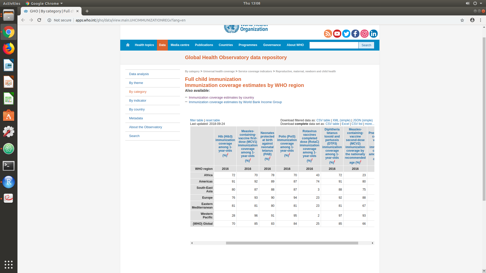

# Ben Watto
# Date:10/3/18

## Question 7
For this question I used data exploration to determine if other diseases such as Polio has enough data to explore the effects of vaccines. Poliomyelitis (polio) is a highly infectious viral disease, which mainly affects young children. The virus can invade the nervous system and lead to paralysis. The data I collected came from World Health Organization. I believe this information comes from a reliable source. The source below shows the percentage of one-year-olds who have received three doses of polio vaccine in a given year. In Africa, 70% are given vaccines, while in Europe and American have a percentage of 94 and 87. There are far less deaths from polio in Europe and America which shows their is an effect from the vaccines. These sources are credible and they provide reliable information to determine the effects of vaccines.

### Sources
- http://apps.who.int/gho/data/view.main.UHCIMMUNIZATIONREGv?lang=en
- http://www.who.int/immunization/en/
- http://www.who.int/topics/poliomyelitis/en/

## Question 8
In the New York Times article, “Journal Retracts 1998 Paper Linking Autism to Vaccines” by Gardiner Harris a research article written by Dr. Andrew Wakefield has been retracted by the authors because it suggests that autism followed from the use of vaccines. The article that states autism is a result of vaccine can lead to damage on public medicine. The damage done can lead to a belief that vaccines are unsafe. Parents believe that their children’s mental problems resulted from vaccinations, even though Dr. Wakefield had been dishonest, violated basic research ethics rules, and motivated by finances. Even with the retraction, many will believe his research is being suppressed, leading to more controversy. After Dr. Wakefield’s study, vaccination rates plunged in Britain and the number of measles cases soared. Overall, his published research creates a lack of trust in vaccines and decrease in protection from diseases.

The role of academic research groups and organizations to ensure that published information is absolutely correct should be to review the data. Before being published, research must be Peer reviewed. Peer review involves exploring the author's scholarly work and research to the scrutiny of other experts in the same field to check its validity and evaluate if its suitable for publication. Multiple peer reviews should be preformed for each study before it is published. The effects of the data on the public should also be determined. Also the study should be examined to see the motivations of the author, as well as how research methods were conducted. Finally, before the research is approved, it should be compared to other data in the field to see if it follows the general trend.

In this situation, the researcher retracted his paper, which means he no longer supports its content. Retracting this paper is not enough to fix the damage done to public medicine. This is because many parents believe that he was forced to retract his research. They still believe that his research was accurate and reliable. To fix the damage done by this paper research should be conducted to disprove the results of Dr. Wakefield. His research should also be recreated to see if similar results would appear. After these are published some of the belief in the correlation between autism and vaccines would decrease. Even after all these steps, some people will still believe the original study so the the only way to stop damage like this is to avoid publishing studies that are not accurate.

## Question 9
One of the main point of the Global Health talk was that data is used to fight disease and to track out-breaks of serious ailments in diverse communities all over the world. There are many sources of publicly available data from the World Health Organization which can help determine whether vaccines are beneficial. Below are two sources involving the use and effect of vaccines.

The first article has research that involves Plasmodium falciparum, which is the most deadly malaria
parasite globally and extremely common in Africa. It explains the vaccine and how it provides protection against malaria among young African children. There was clinical testing in seven African countries which show the vaccines ability to boost malaria prevention and save lives.

The second article involves vaccinating dogs to stop their spread of rabies in dogs younger than 12 months of age. Rabies presents a public health risk to humans as well. The higher occurrence of rabies in young dogs is believed to be from a lack of vaccination on this age group. To test this belief, dogs around 3 months old were vaccinated to examine the correlation between developing rabies and the vaccination. Because of the risk to human health the author suggests that all dogs over 3 months of age be vaccinated against rabies.

### Sources
- http://www.who.int/malaria/publications/atoz/first-malaria-vaccine/en/
- http://www.who.int/rabies/resources/vr_102975/en/

## Question 10
During our lab session, we had talk involving Global Health. The talk was given by Dr. Becky Dawson and Dr. Amelia Finaret. One main points was how data was used to fight disease and track out-breaks. What I found interesting about the talk was how health sampling does not use random sampling to examine the population. They use clustered techniques to create a representation of the population. In my mind, I assumed that it would be random sampling, but it makes logical sense because not everyone is willing to take the time to complete a survey. I think without the random sampling the wrong assumptions could be made about the population. If studies gave more incentives such as money for the time or something enjoyable they might get greater participation, but it would cause research to become far more expensive.
